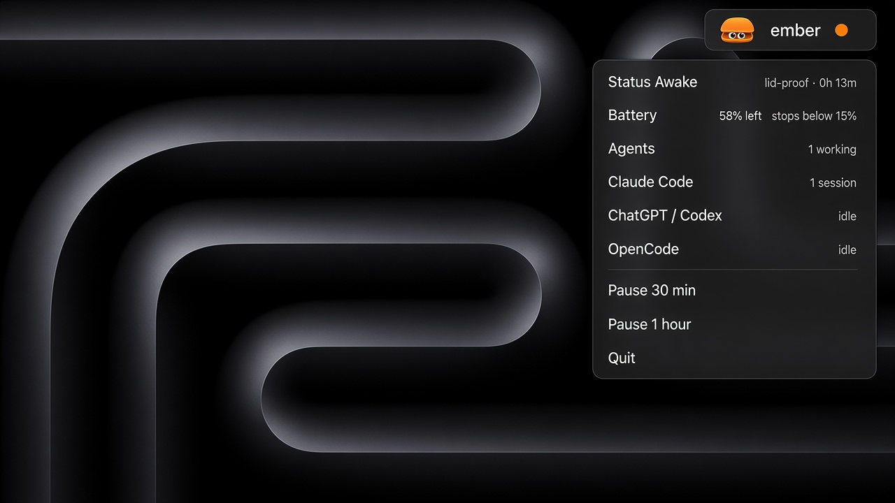

# ember

[](https://github.com/smeltery/ember/actions/workflows/ci.yml)
[](https://github.com/smeltery/ember/actions/workflows/release.yml)
[](LICENSE)
[](https://bun.sh/)
[](packages/core)
[](macos)
[](docs/getting-started.md)
[](.pre-commit-config.yaml)
[](https://flox.dev)

Open-source keep-awake for macOS that holds sleep only while your AI coding
agents are working — then lets the Mac rest again.

<p align="center">
  
</p>

## Quick start

```bash
flox activate   # optional
bun install
bun run dev     # marketing site
cd macos && swift build && open .build/debug/Ember   # menu bar app
```

Or download a build from [Releases](https://github.com/smeltery/ember/releases).

## Features

- Agent-driven wake lock (PreventUserIdleSystemSleep via `caffeinate` while mid-task)
- Lifecycle hooks for Claude Code, Codex, OpenCode, Gemini, Pi, Copilot CLI, Hermes
- Process detection for Cursor, Cline, Warp, Aider, Windsurf, Continue, Amp, Goose
- Pause 30 minutes or 1 hour from the menu bar
- Battery cut-off, optional plugged-in-only, Low Power Mode respect
- LOC and flat-directory budget gates in CI / pre-commit

## Docs

Full guides live in [`docs/`](docs/README.md).

## License

[PolyForm Shield 1.0.0](LICENSE)
