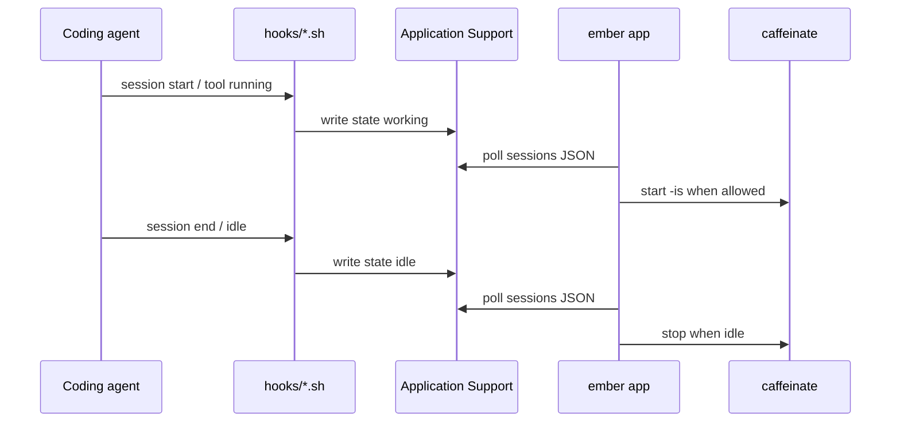

# Agents

ember watches agents two ways: **lifecycle hooks** (preferred) and **process
detection** when hooks are unavailable.

## Supported agents

| Agent | Detection | Hook script |
| --- | --- | --- |
| Claude Code | hooks | [`hooks/claude-code.sh`](../hooks/claude-code.sh) |
| ChatGPT / Codex | hooks | [`hooks/codex.sh`](../hooks/codex.sh) |
| OpenCode | hooks | [`hooks/opencode.sh`](../hooks/opencode.sh) |
| Gemini CLI | hooks | use [`generic-working.sh`](../hooks/generic-working.sh) / [`generic-idle.sh`](../hooks/generic-idle.sh) with `EMBER_AGENT=gemini` |
| Pi | hooks | generic scripts with `EMBER_AGENT=pi` |
| Copilot CLI | hooks | generic scripts with `EMBER_AGENT=copilot-cli` |
| Hermes | hooks | generic scripts with `EMBER_AGENT=hermes` |
| Cursor | process | none (watched via `ps`) |
| Cline | process | none (watched via `ps`) |

## Lifecycle sequence

## Environment variables

Common across scripts (see comments in each file):

| Variable | Meaning |
| --- | --- |
| `EMBER_AGENT` | Agent id written into JSON |
| `EMBER_SESSION` | Session id (file name) |
| `EMBER_STATE` | `working` or `idle` |

Agent-native fallbacks (examples): `CLAUDE_SESSION_ID`, `CODEX_SESSION_ID`,
`OPENCODE_SESSION_ID`.

## Process detection

Cursor and Cline do not need hooks. ember scans process command names for
known substrings (for example `cursor-agent`, `Cline`). Presence counts as
Working for wake decisions.
