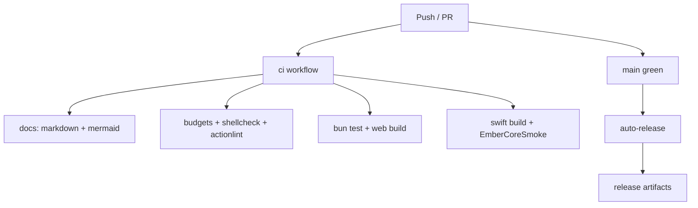

# CI

Continuous integration runs on GitHub Actions from the default branch and pull
requests. Workflows live under `.github/workflows/` (not duplicated here).

## Job overview



## Typical checks

| Job | What it verifies |
| --- | --- |
| TypeScript tests | `packages/core` wake / battery / hooks / agents |
| Web build | Vite production build for `apps/web` |
| Docs hygiene | markdown, mermaid fences, internal doc links |
| Budgets | file size / flat directory guards when enabled |
| Swift | `swift test` for EmberCore on macOS runners |

## Local parity

```bash
bun run ci
cd macos && swift test
```

See [Releasing](releasing.md) for how main-branch greens become releases.
