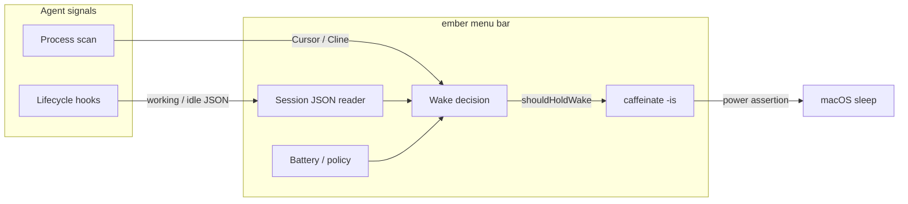

# How it works

ember holds the Mac awake only while a watched AI coding agent is mid-task.
Idle agents (and empty process watches) let sleep return — including with the
lid closed.

## Architecture



## Data flow

1. **Hooks** (Claude Code, Codex, OpenCode, …) call scripts in `hooks/` that
   write session files under Application Support.
2. **ember** polls about every 2 seconds:
   - Loads `sessions/**/*.json`
   - Optionally matches Cursor / Cline in `ps`
   - Reads battery from `pmset -g batt`
3. **Wake decision** (shared concepts with the TypeScript core) combines
   activity, pause-until, and battery policy.
4. When `shouldHoldWake` is true, ember keeps a child `caffeinate -is` process
   running (`-i` idle sleep, `-s` system sleep) — the practical equivalent of
   holding PreventUserIdleSystemSleep while agents work.

## Session file shape

```json
{
  "state": "working",
  "agent": "claude-code",
  "sessionId": "abc",
  "updatedAt": "2026-01-01T00:00:00Z"
}
```

`state` is `working` or `idle` (case-insensitive). Nested directories under
`sessions/` are supported.

## Related

- Pure decision logic: `macos/Sources/EmberCore` and `packages/core`
- App shell: `macos/Sources/Ember`
