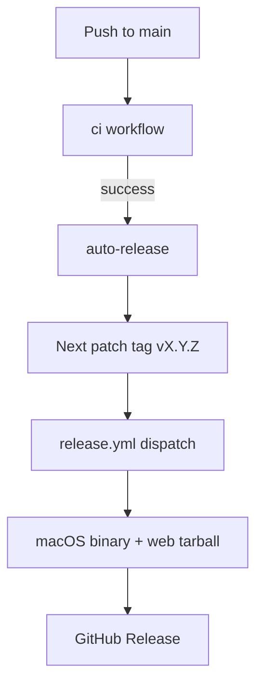

# Releasing

ember cuts a GitHub Release from **main** when CI is green — the same
hab-style auto-release loop used across smeltery.

## Auto-release from main



1. Land a commit on `main`.
2. `ci` must finish green.
3. `auto-release` tags the next patch (`v0.1.0`, then `v0.1.1`, …) if HEAD is untagged.
4. It dispatches `release.yml`, which validates the tag, rebuilds, and publishes assets.

A tag created with `GITHUB_TOKEN` does not start `release.yml` by itself — the
explicit dispatch in `auto-release.yml` is required.

## Artifacts

| Asset | Contents |
| --- | --- |
| `ember-macos-arm64` | Release build of the menu bar binary |
| `ember-web-<version>.tar.gz` | Production Vite site |
| `SHA256SUMS` | Checksums for both |

## Manual fallback

```bash
export RELEASE_TAG=v0.1.0
bash scripts/pack-release.sh
gh release create "$RELEASE_TAG" --generate-notes dist-release/*
```

## Related

- [CI](ci.md)
- [Getting started](getting-started.md)
